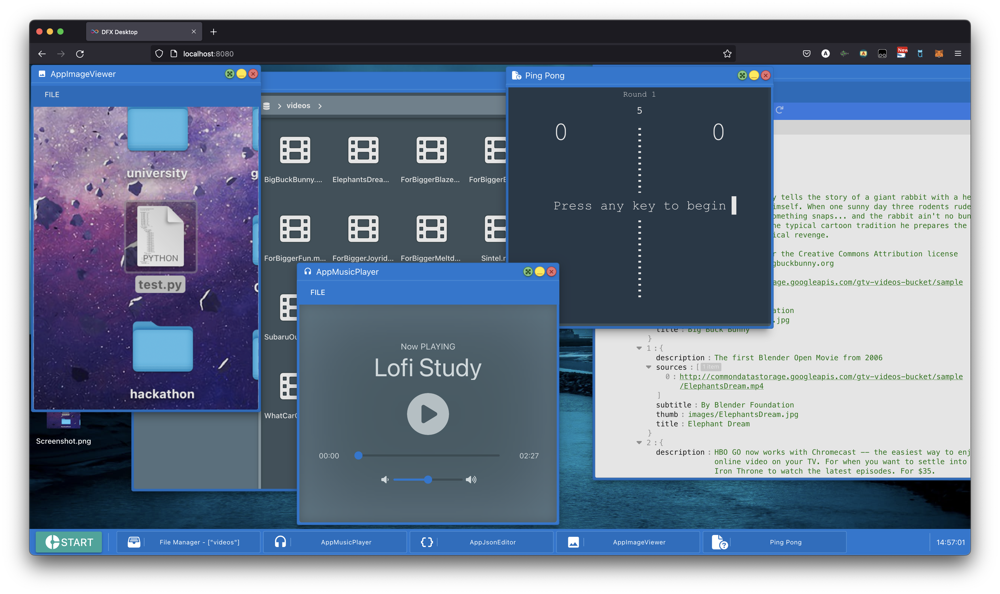

## Inspiration

Ever since I heard about decentralized technology 3 to 4 years back, my mind had all kinds of interesting, good, and bad ideas, including `OS` on-chain. A thought would come to my mind that should I try to implement it and see where would it take me, but procrastination always put these ideas in the backseat; I would give time to other projects. This time around, I decided to do it as I found the project to be possible with a canister model of `Dfinity` and memory cost, which is acceptable by many. Although I had the idea to implement a whole `OS`, I soon found it laborious and time-intensive and decided to implement a desktop. After the competition, I would love to implement `OS` on the blockchain if I get the time and more resources.

## What it does

The app tries to move desktop experience on the blockchain allowing users to access it anywhere in the world as long as they have a proper internet connection. You can create and edit text, play audio or music, watch videos, open images, etc. At this point, we have limited features that could be extended in the future.

## How we built it

As of right now, I have implemented everything using HTML, CSS, Vue, Dfinity and Typescript and other third-party libraries.

## Challenges we ran into

There were a few problems that gave me a hard time:

- Designing the System.
- Storing assets.
- Caching the data so that you do not put pressure on bandwidth.
- Trying to design the best way to interact with the canister.
- Adding window apps dynamically.
- Adding a context menu
- Adding quasi-support for offline interaction.

There are also a few problems that I'm unable to solve:

- Adding web worker (due to limitation)
- Adding full support for offline mode.
- Allowing streaming rather than downloading the whole asset in one go.

## Accomplishments that we're proud of

The thing that I'm most proud of is how the app turns out, and a few honorary mentions:

- Improved knowledge of Typescript, Vue, HTML and CSS.
- Designed cache manager, window manager, etc

## What we learned

- Learned to work with webpack, Dfinity's canister and Motoko
- IndexedDb
- How to design a system

## What's next for Mini Desktop

My next task would be to move the implementation to wasm and optimize the app properly. Furthermore, add features, such as shortcuts, notifications, full offline support, etc., and bring the app close to its offline counterpart.

For more screenshots [click here](assets).
